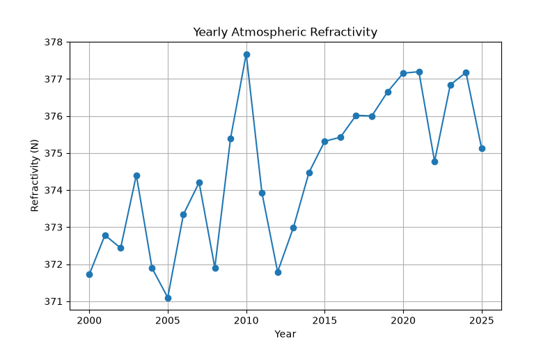
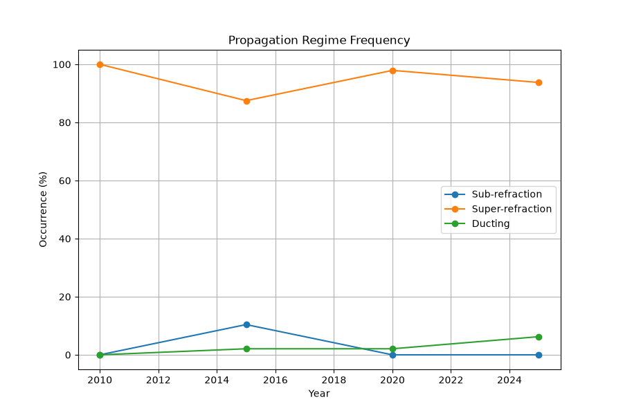

# Study Period Validation for Atmospheric Radio Refractivity over the Mumbai Coastal Region (ERA5)

A statistical validation pipeline that computes atmospheric radio refractivity from ERA5 reanalysis at surface and pressure levels, and establishes a temporally stable, representative study period for downstream electromagnetic wave propagation modelling over the Mumbai coastal Arabian Sea.

<p align="center">
  
</p>

<p align="center">
  <em>Yearly mean atmospheric radio refractivity, 2000–2025 — the long-term signal this study period selection is validated against.</em>
</p>

---

## 1. Objectives

This project addresses three linked questions, forming the validation stage that precedes full EM propagation model development:

1. **Is the atmospheric refractive environment over the study domain temporally stable enough** to justify selecting a fixed multi-year window as a representative "study period," rather than treating every year as statistically distinct?
2. **Which years, seasons, and times of day are dominated by which propagation regime** (sub-refraction, normal/super-refraction, or ducting), and how consistent is that regime distribution from year to year?
3. **Can this stability be demonstrated quantitatively** — through inter-annual similarity, confidence intervals, and trend analysis — rather than assumed?

---

## 2. Study Area

| Parameter | Domain |
|---|---|
| Latitude | 18.75°N – 19.25°N |
| Longitude | 72.50°E – 73.00°E |
| Location | Mumbai coastal Arabian Sea |
| Pressure levels | 1000, 925, 850 hPa |
| Years analysed (pressure-level) | 2010 – 2025 |
| Years analysed (single-level) | 2000 – 2025 |

---

## 3. Methodology Overview

The pipeline runs in three sequential stages: a surface-level refractivity characterisation, a pressure-level refractivity reconstruction, and a formal statistical validation of the study period.

**1. Surface refractivity analysis** — 2 m temperature, 2 m dew point, and surface pressure from ERA5 single-level data are converted into near-surface radio refractivity, then summarised by month, season, year, and hour to characterise the long-term surface refractive climate (2000–2025).

**2. Pressure-level refractivity reconstruction** — Temperature, specific humidity, and geopotential from ERA5 pressure-level data (1000/925/850 hPa) are spatially averaged over the domain and converted into radio refractivity and geometric height at each level (2010–2025).

**3. Study-period validation** — The pressure-level refractivity record is used to compute yearly statistics, propagation-regime frequencies, vertical refractivity gradients, an inter-annual similarity matrix, a linear trend, and 95% confidence intervals — the combined evidence base for selecting a representative study period.

---

## 4. ERA5 Input Data

Hourly ERA5 reanalysis data, provided by the Copernicus Climate Change Service and ECMWF.

**Single-level variables** (2000–2025)

| Variable | Role |
|---|---|
| 2 m temperature | Near-surface thermal state |
| 2 m dew-point temperature | Near-surface moisture (via Tetens' equation) |
| Surface pressure | Atmospheric thermodynamic state |
| Sea-surface temperature | Lower boundary condition |
| Boundary layer height | Vertical mixing depth |

**Pressure-level variables** (2010–2025, at 1000/925/850 hPa)

| Variable | Role |
|---|---|
| Temperature | Thermodynamic state at each level |
| Specific humidity | Moisture content, converted to vapour pressure |
| Geopotential | Converted to geometric height |

Input files live under `01_Data/`: `ERA5_Single_Level_2000_2025.nc` / `reanalysis-era5-single-levels-timeseries.nc` for the surface analysis, and `ERA5_Pressure_Level_2010_2025.grib` (with a sparser `2010_2015_2020_2025` companion extract used for report figures) for the pressure-level analysis. `processed_pressure.nc` is the intermediate refractivity/height product consumed by the validation stage.

---

## 5. Radio Refractivity

Both stages compute radio refractivity via the standard bulk formulation:

```
N = 77.6 (P/T) + 3.73×10⁵ (e/T²)
```

where `P` is pressure (hPa), `T` is temperature (K), and `e` is water vapour pressure (hPa).

- **Surface stage:** `e` is derived from 2 m dew point using the **Tetens equation**: `e = 6.112 exp(17.67·Tdc / (Tdc + 243.5))`.
- **Pressure-level stage:** `e` is derived from specific humidity `q` and level pressure `P`: `e = qP / (0.622 + 0.378q)`.

Geopotential is converted to geometric height via `h = z / g` (g = 9.80665 m/s²), giving the vertical structure needed for gradient and ducting diagnostics.

---

## 6. Study-Period Validation Diagnostics

Five independent statistical checks are computed across the 2010–2025 record to test temporal stability:

1. **Yearly statistics** — mean, standard deviation, min, max, and coefficient of variation of N for each year.
2. **Propagation-regime frequency** — each hourly 1000–925 hPa refractivity gradient is classified against standard thresholds:
   - **Sub-refraction:** gradient > −40 N-units/km
   - **Normal / super-refraction:** −157 < gradient ≤ −40 N-units/km
   - **Ducting:** gradient ≤ −157 N-units/km
3. **Gradient statistics** — annual mean and standard deviation of the 925–1000 hPa vertical refractivity gradient.
4. **Inter-annual similarity matrix** — Pearson correlation between each pair of years' mean vertical refractivity profiles.
5. **Linear trend and 95% confidence intervals** — least-squares trend of domain-mean N over time, and a 95% CI on each year's mean.

---

## 7. Results

### 7.1 Yearly refractivity statistics (2010–2025)

| Statistic | Value |
|---|---|
| Mean of yearly means | 317.8 N-units |
| Std. dev. across years | 2.4 N-units |
| Lowest annual mean | 313.4 N-units (2012) |
| Highest annual mean | 322.0 N-units (2020) |
| Typical intra-year CV | ~13–15% |

Year-to-year variation in the mean state is small (≈0.7% of the mean), while within-year variability (CV ~13–15%) reflects normal seasonal and diurnal cycling rather than instability between years.

### 7.2 Propagation-regime frequency (2010–2025)

| Regime | Mean occurrence | Range across years |
|---|---|---|
| Super-refraction (normal) | 95.6% | 93.2% – 98.7% |
| Ducting | 2.5% | 0.4% – 4.7% |
| Sub-refraction | 1.9% | 0.8% – 3.4% |

<p align="center">
  
</p>

The domain is dominated by normal (super-refractive) propagation in essentially every year, with ducting and sub-refraction consistently confined to a small, stable minority of hours — supporting the case for a shared, representative multi-year window rather than treating individual years as atmospherically distinct regimes.

### 7.3 Inter-annual similarity

Pairwise Pearson correlations between years' mean vertical refractivity profiles range from **0.9978 to >0.9999** across all 16 years (2010–2025), with a mean pairwise correlation above 0.999. This is the strongest single piece of evidence for temporal homogeneity: every year's vertical refractivity structure is almost perfectly linearly similar to every other year's.

### 7.4 Long-term trend

<p align="center">
  
</p>

The 2000–2025 yearly mean refractivity shows a gentle upward drift (~371–378 N-units) with interannual scatter but no abrupt discontinuity, consistent with a slowly evolving climatic baseline rather than a structural break that would invalidate a fixed study period.

### 7.5 Confidence intervals

95% confidence intervals on each year's mean N (from `Confidence_Intervals.csv`) are narrow (typically ±3 N-units) and overlap extensively across the full 2010–2025 span — statistically consistent with a single underlying population rather than distinct year-to-year regimes.

---

## 8. Repository Structure

```
Study_Period_Validation/
│
├── 01_Data/
│   ├── ERA5_Single_Level_2000_2025.nc                 Surface variables, 2000–2025
│   ├── reanalysis-era5-single-levels-timeseries.nc    Alternate single-level extract
│   ├── ERA5_Pressure_Level_2010_2025.grib             Pressure-level variables, 2010–2025
│   ├── ERA5_Pressure_Level_2010_2015_2020_2025.grib   Sparse 4-year extract (report figures)
│   └── processed_pressure.nc                          Intermediate N / height product
│
├── 02_Python_Codes/
│   ├── 01_Surface_Refractivity_Analysis.py    Surface N from 2 m T/Td/P; monthly/seasonal/
│   │                                            annual/diurnal climatology + summary stats
│   ├── 02_Pressure_Level_Refractivity.py      Pressure-level N and height reconstruction,
│   │                                            spatially averaged over the domain
│   └── 03_Study_Period_Validation.py          Yearly stats, regime classification, gradient
│                                                stats, similarity matrix, trend, 95% CIs
│
├── 03_Tables/
│   ├── Yearly_Statistics.csv         Per-year mean/std/min/max/CV of N
│   ├── Propagation_Regime.csv        Per-year sub-refraction/super-refraction/ducting (%)
│   ├── Gradient_Statistics.csv       Per-year mean/std vertical refractivity gradient
│   ├── Similarity_Matrix.csv         16×16 inter-annual profile correlation matrix
│   └── Confidence_Intervals.csv      Per-year mean N with 95% confidence bounds
│
├── 04_Figures/
│   ├── Monthly / Seasonal / Annual / Diurnal refractivity climatology
│   ├── Yearly refractivity trend, gradient, and modified-refractivity profiles
│   ├── Propagation-regime frequency and seasonal stability plots
│   ├── Boundary-layer-height and SST trend figures
│   └── Refractivity anomaly, extreme-value, and monthly-boxplot diagnostics
│
└── 05_Report/
    └── Report.docx    Full written analysis and validation report
```

---

## 9. Reproducibility

```
1. ERA5_Single_Level_2000_2025.nc → 01_Surface_Refractivity_Analysis.py
     → Monthly/Seasonal/Annual/Diurnal_Refractivity.png,
       Surface_Refractivity_Statistics.csv

2. ERA5_Pressure_Level_2010_2025.grib → 02_Pressure_Level_Refractivity.py
     → processed_pressure.nc

3. processed_pressure.nc → 03_Study_Period_Validation.py
     → Yearly_Statistics.csv, Propagation_Regime.csv, Gradient_Statistics.csv,
       Similarity_Matrix.csv, Confidence_Intervals.csv
```

Each script is run from `02_Python_Codes/` and expects its corresponding input file to be present in the working directory.

---

## 10. Current Status

✓ ERA5 single-level and pressure-level datasets processed
✓ Surface and pressure-level radio refractivity computed
✓ Propagation-regime classification completed for all years
✓ Inter-annual similarity, trend, and confidence-interval analysis completed
✓ **2010–2025 validated as a statistically representative study period**
⏳ Full electromagnetic wave propagation prediction framework (next stage, separate repository)

---

## 11. Limitations

- ERA5 provides a modelled atmospheric state, not direct local observations.
- Propagation-regime thresholds (sub-refraction / super-refraction / ducting) follow standard vertical-gradient conventions and are not independently recalibrated for this coastal domain.
- The vertical structure is resolved at only three pressure levels (1000/925/850 hPa); finer near-surface gradients (as relevant to evaporation ducting specifically) are not captured here.
- Domain-averaging over a 0.25°×0.5° box smooths out any sub-grid coastal variability.
- High inter-annual similarity demonstrates linear correlation of profile shape, not necessarily equality of absolute magnitude or extreme-event frequency.

---

## 12. Future Work

- Extend the validated 2010–2025 study period into the full EM wave propagation prediction framework.
- Add finer vertical resolution (more pressure levels) to better resolve near-surface ducting gradients.
- Cross-validate propagation-regime classification against independent radiosonde or shipborne observations.
- Extend seasonal/diurnal stability analysis with formal (non-visual) statistical tests (e.g., Levene's test for variance homogeneity across years).

---

## 13. Technology Stack

**Programming and scientific computing** — Python 3.13, NumPy, Pandas, xarray, SciPy, Matplotlib

**Reanalysis data processing** — Copernicus Climate Data Store API, ERA5, NetCDF, GRIB, cfgrib

**Physical modelling** — Bulk radio refractivity formulation (ITU-R P.453 form), Tetens equation for vapour pressure

---

## 14. Data Source

**Provider:** Copernicus Climate Change Service (C3S) / ECMWF
**Dataset:** ERA5 hourly data on single levels and pressure levels
**Surface record:** 2000–2025
**Pressure-level record:** 2010–2025
**Access:** https://cds.climate.copernicus.eu

---

## 15. Scientific Context

Before any electromagnetic wave propagation model can be trusted, the atmospheric conditions it is trained or validated on must be shown to be representative of the broader climate — not an artifact of an arbitrarily chosen time window. This project provides that statistical foundation for the Mumbai coastal Arabian Sea: demonstrating, through five independent diagnostics, that 2010–2025 is a stable, internally consistent study period suitable for downstream radio refractivity and propagation modelling work.

---

## 16. Author

**Midushi Maheshwari**
B.Tech. Electronics and Communication Engineering with Specialization in AI | IGDTUW | Undergraduate Research Project

### Citation

If this repository or its methodology is used in subsequent research, please cite the repository and acknowledge the underlying ERA5 dataset and the refractivity formulation referenced in Section 5.

### License
This project is licensed under the MIT License. You are free to use, modify, and distribute the code, subject to the terms of the license.

See the LICENSE file for the full license text.

For further information, please contact **midushi.maheswari@gmail.com**
